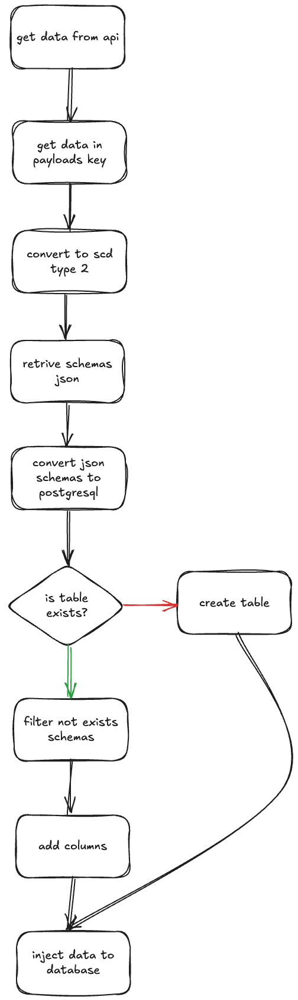

# My New Friend Mage AI

## Description
This repo contain the author result when learn Mage AI. Mage AI is similiar with Airflow, its main purpose is to orchestrate data pipelines. In this project, created a simple bronze data pipeline which extract data from api then insert into postgresql data warehouse.

## Goals
Create bronze pipeline that implement slow changing dimension type 2 then automatically create table if not exists, add columns if key is not exists in table schema, and insert data into postgresql.

## Flow Bronze Pipeline
